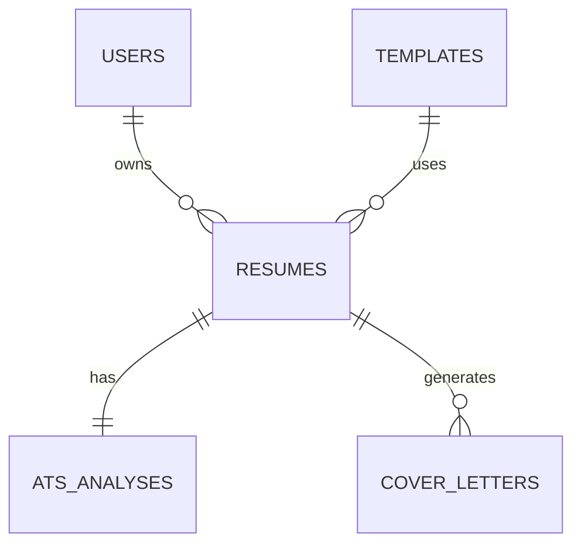

# Agent Apply - Database Design Document

## Entities

### users (Supabase Auth)
| Field | Type | Constraints |
|---|---|---|
| id | UUID | PK |
| created_at | Timestamp | Not Null |

---

### templates
| Field | Type | Constraints |
|---|---|---|
| id | UUID | PK |
| name | Text | Unique, Not Null |
| description | Text | |
| latex_template_path | Text | Not Null |
| preview_image | Text | |
| created_at | Timestamp | Not Null |

---

### resumes
| Field | Type | Constraints |
|---|---|---|
| id | UUID | PK |
| user_id | UUID | FK → users.id |
| template_id | UUID | FK → templates.id |
| title | Text | Not Null |
| resume_data | JSONB | Not Null |
| created_at | Timestamp | Not Null |
| updated_at | Timestamp | Not Null |

`resume_data` schema:

```json
{
  "personal_info": {},
  "summary": "",
  "education": [],
  "experience": [],
  "projects": [],
  "skills": [],
  "certifications": [],
  "languages": [],
  "achievements": []
}
```

---

### ats_analyses
| Field | Type | Constraints |
|---|---|---|
| id | UUID | PK |
| resume_id | UUID | FK → resumes.id, Unique |
| overall_score | Integer | |
| strengths | JSONB | |
| weaknesses | JSONB | |
| recommendations | JSONB | |
| analyzed_at | Timestamp | Not Null |

---

### cover_letters
| Field | Type | Constraints |
|---|---|---|
| id | UUID | PK |
| resume_id | UUID | FK → resumes.id |
| company_name | Text | |
| job_title | Text | |
| content | Text | Not Null |
| created_at | Timestamp | Not Null |

---

## Relationships



---

## Indexes

### users
- PK(id)

### templates
- PK(id)
- UNIQUE(name)

### resumes
- PK(id)
- INDEX(user_id)
- INDEX(template_id)
- INDEX(user_id, updated_at)

### ats_analyses
- PK(id)
- UNIQUE(resume_id)

### cover_letters
- PK(id)
- INDEX(resume_id)

---

## Ownership

| Table | Owner |
|---|---|
| users | User |
| resumes | User |
| ats_analyses | User |
| cover_letters | User |
| templates | System |

---

## AI Storage

Persist:
- Resume content
- ATS analysis
- Cover letters

Do not persist:
- Prompts
- Raw LLM responses
- Chain of thought

---

## File Storage

- Uploaded resumes are parsed into JSON.
- Original upload deleted after parsing.
- PDFs generated on demand.
- Database stores only template metadata.

---

## Design Decisions

- Resume stored as JSONB to keep schema simple.
- Templates separated to avoid duplication.
- ATS analysis isolated from resume.
- Cover letters stored separately (one resume → many cover letters).
- Hard delete only; no soft delete.
